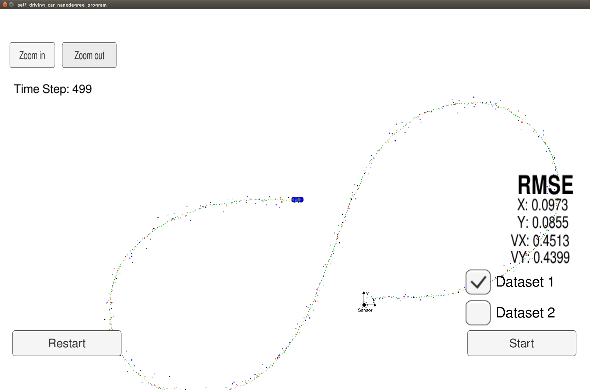
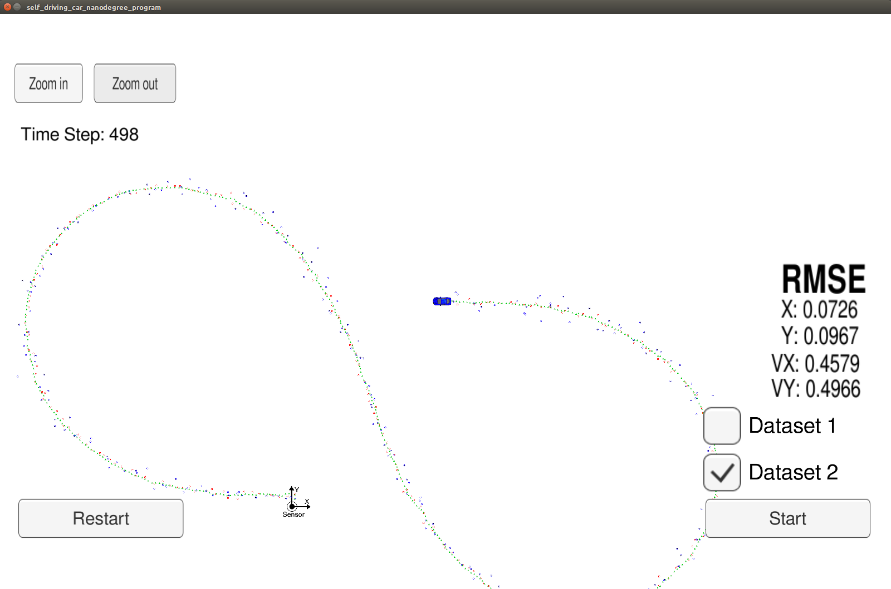
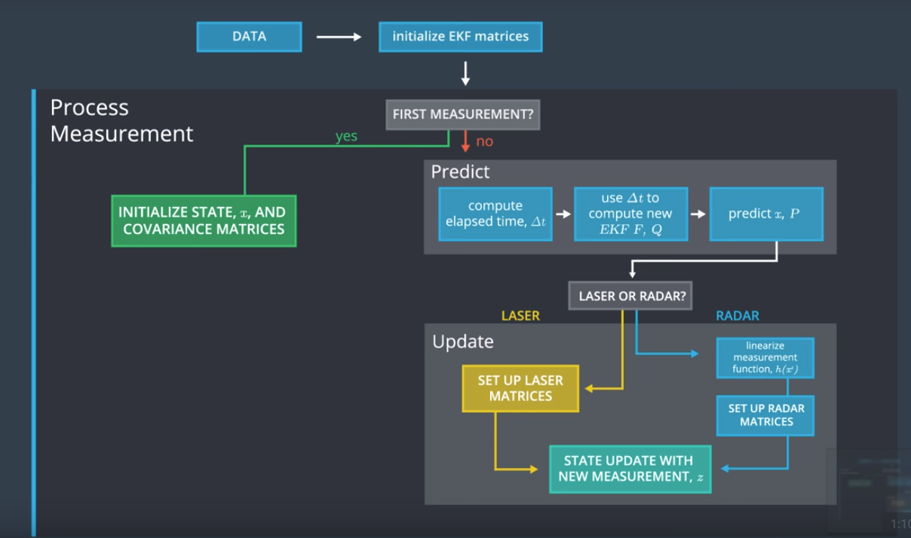

# Extended Kalman Filter Project
Self-Driving Car Engineer Nanodegree Program

In this project you will utilize a kalman filter to estimate the state of a moving object of interest with noisy lidar and radar measurements. Passing the project requires obtaining RMSE values that are lower that the tolerance outlined in the project rubric.

This project involves the Term 2 Simulator which can be downloaded [here](https://github.com/udacity/self-driving-car-sim/releases)

## How to compile and run: 

    Perform steps following:

    - Clone this repos
    - Make build directory: **mkdir build && cd build**
    - Compile the code: **cmake .. && make**
    - Run the code: **./ExtendedKF **
    - Start and run Project 1/1 EKF and UKF of Self Driving Car Simulator

## Results: 

#### Dataset 1

#### Dataset 2

## Program flow 
#### First measurement
- The filter will receive initial measurements of the object relative to the car. These measurements will come from a radar or lidar sensor.

#### Initialize state and covariance matrices
- The filter will initialize the object position based on the first measurement.

#### Predict
- The algorithm will predict where the object will will be after time Δt. In this EKF, we will assume the velocity is constant. The filter predict the object location after Δt is to assume the object velocity is constant, thus the object will have moved velocity * Δt.

#### Measurement Update
- The filter compares the "predicted" location with what the sensor measurement says. The predicted location and the measured location are combined to give an updated location. The kalman filter will put more weight on either the predicted location or the measured location depending on the uncertainty of each value.

